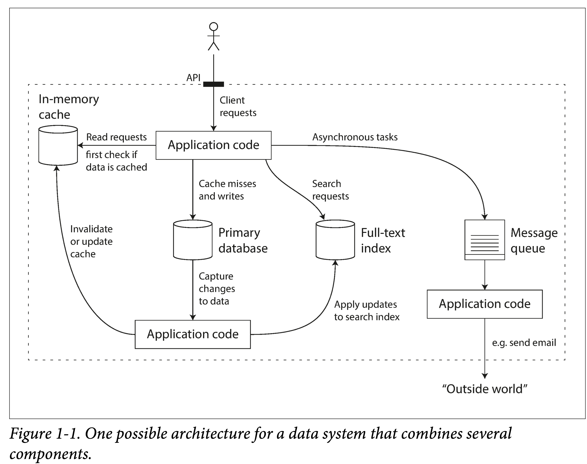

### Foreword

Data system is a vague general term. In the information society, everything can be informatized, or, to some extent, digitalized. The collection, storage and use of these data form the basis of the information society. Most of our common applications are supported by a data system, such as WeChat, JD.com, Weibo, etc. 

### What are the common data systems?

* Store data so it can be used again later - **database**
* Remember some very "heavy" operation results to facilitate faster reading later - **caching**
* Allow users to search with various keywords and filter data with various conditions - **search engine**
* Continuously generate data and send it to other processes for processing - **streaming processing**
* Periodically process large amounts of accumulated data - **batch processing**
* Transmit and distribute messages - **message queue**
  These concepts are so familiar that we just use them when designing systems without thinking about their implementation details, let alone implementing them from scratch. Of course, this also illustrates how successful these concepts are in abstraction.

### The increasing complexity of data systems

However, over the years, as application requirements have become more complex, many new types of data collection, storage and processing systems have emerged. They are not limited to a single function, and they are difficult to classify rigidly into a certain category. Just to give a few examples:

* Kafka: It can be used to store and persist log data for a period of time, it can be used as a message queue to distribute data, it can be used as a streaming component to repeatedly distill data, and so on.
* Spark: It can process data in batches or convert small batches into streams to stream data.
* Redis: It can be used as a cache to accelerate access to the database, and can also be used as an event center to publish and subscribe to messages.
  When we face a new scenario and use these components in a certain combination, to a certain extent, we create a new data system. The book gives a common example of a data system that collects, stores, queries, and bypasses user data. You can see the shadow of various Web Services from its schematic diagram.

But for such a small system, there are many trade-offs when designing:

1. What caching strategy to use? Is it bypass or write penetration?

2. When there is a problem with some component machines, is it to ensure availability or consistency?

3. When the machine is temporarily difficult to recover, how to ensure the accuracy and integrity of the data?

4. When the load increases, should we add more machines or improve the performance of a single machine?

5. When designing an external API, should we strive for simplicity or power?

   Therefore, it is necessary to think fundamentally about how to evaluate a good data system, how to build a good data system, and what design patterns can be followed? What are some common aspects to consider?

The book uses three words to answer: **Reliability, Scalability**, and **Maintainability**

### Reliability

How to evaluate reliability?

**Functionally**

1. Under normal circumstances, the application behavior meets the behavior given by the API
   * Ability to handle properly when the user inputs/operates incorrectly
   * In terms of performance, it can meet the promised performance indicators under the given hardware and data volume.
2. Security can prevent unauthorized and malicious damage.
3. Availability is also an aspect of reliability, and cloud services usually measure availability in nines.

Two confusing concepts: **Fault (system problems)** and **Failure (system cannot provide services)**

A system that cannot perform fault-tolerance will easily fail if it accumulates too many faults.

How to prevent it? Chaos testing: like Netflix’s chaosmonkey.

**Hardware malfunction**

In a large data center this is the norm:

1. Network jitters and blockage
2. Hard drive aging and bad sectors
   memory failure
3. Machine Overheating Causes CPU Problems
4. Power outage in computer room
5. Common hardware indicators that need to be considered in data systems:

* MTTF mean time to failure The mean time to failure of a single disk is 5 to 10 years. If you have 10,000+ hard disks, you can expect that a bad disk will appear every day. Of course the fact is that hard drives will fail in waves.
  The solution is to increase redundancy: **multi-channel power supply in the computer room, dual networks, etc**.

For data:

* Standalone: RAID redundancy is possible. Such as: EC encoding.
* Multi-machine: Multiple copies or EC encoding.

**Software Failure **

Compared to the randomness of hardware failures, software errors are more correlated:

1. Certain input cannot be processed, causing the system to crash.
2. Runaway processes (such as loops without releasing resources) exhaust CPU, memory, and network resources.
3. System dependent components become slow or even unresponsive.
4. Cascading failures.
   When designing software, we usually have some environmental assumptions and some **implicit constraints**. As time goes by and the system continues to run, if these assumptions cannot continue to be satisfied; if these constraints are destroyed by subsequent maintainers when adding functions, the system that initially ran normally may suddenly collapse.

**Man-made Problems**

The most unstable thing in the system is people, so the impact of people on the system should be eliminated as much as possible at the design level. According to the software life cycle, it is considered in several stages:

**design coding**

1. Eliminate all unnecessary assumptions where possible, provide reasonable abstractions, and design your API carefully
2. Isolate processes and use sandboxing for particularly error-prone modules
3. Circuit breaker design for service dependencies

**testing phase**

1. Introduce third-party member testing as much as possible and try to automate the testing platform
2. Unit testing, integration testing, e2e testing, chaos testing

**running phase**

1. Detailed dashboard
2. Continuous self-test
3. Alarm mechanism
4. problem plan

**For organizations**
1.Scientific training and management

### Scalability

Scalability is the system's ability to cope with load growth. It is important, but it is difficult to do well in practice because there is a basic contradiction: only products that can survive are qualified to talk about expansion, and premature design for expansion often does not survive.

But you can still understand some basic concepts to deal with possible sudden increases in load.

#### Measure load

Before dealing with the load, you must first find a suitable method to measure the load, such as load parameters:

* Application daily and monthly activity
* Requests to the web server per second
* Read to write ratio in database
* Number of concurrently active users in the chat room

The book uses information disclosed by Twitter in November 2012 as an example:

1. Identify the main business: publishing tweets, home page feed flow.
2. Determine their request magnitude: Tweeting (average 4.6k requests/sec, peaking at over 12k requests/sec), viewing other people’s tweets (300k requests/sec)

As far as this data level is concerned, no matter how it is designed, it is not a big problem. But Twitter needs to process the data multiple times based on the following and followed relationships between users. There are two common methods of push and pull:

1. **pull**. When each person views their homepage feed stream, all tweets from the following users are pulled from the database and combined for presentation.
2. **push.** Save a feed stream view for each user and when the user tweets, insert it into all followers feed stream views.

The former is Lazy. Users will only pull it when viewing it. There will be no invalid calculations and requests, but it needs to be calculated every time and the rendering speed is slow. And it can’t handle a large amount of traffic.

The latter calculates the view in advance, regardless of whether the user sees it or not, and the rendering speed is faster, but it will introduce many invalid requests.

**Measure Performance**

Note that it is distinguished from system load. System load examines the system from the user's perspective and is an objective indicator. System performance is an actual capability of the described system. for example:

1. **Throughput**: The unit amount of data that can be processed per second, usually recorded as QPS.
2. **Response time**: The time observed from the user side from issuing a request to receiving a reply.
3. **Latency**: In daily life, latency is often mixed with response time to refer to response time; but strictly speaking, latency only refers to the waiting time in queue during the request process, although it generally accounts for the majority of the response time; but only when we put the request The real processing time is considered to be instantaneous, and the delay can be equal to the response time.

Response times are often measured in percentile points, such as p95, p99, and p999, which mean that 95%, 99%, or 99.9% of requests are completed within that threshold. In practice, a sliding window is usually used to calculate the response time distribution in the most recent period, and is usually presented in a line chart or bar chart.

**Cope with load**

After having the means to describe and define load and performance, we finally come to the topic, how to deal with the continuous growth of load, even if the system is scalable.

1. **Scaling up or vertical scaling**: changing to a machine with more powerful performance. e.g. Mainframe machine learning training.
2. **Scaling out or horizontal scaling**: "paralleling" many cheap machines to share the load. e.g. Musk builds rockets.

Two ways of load expansion:

1. **Automatic** If the load is unpredictable and variable, automatic is better. The disadvantage is that it is difficult to track the load and is prone to jitter, resulting in a waste of resources.
2. **Manual** Manual is best if the load is easy to predict and does not vary over time. The design is simple and less error-prone.
   For different application scenarios:

First of all, if the scale is small, try to use a machine with better performance, which can save a lot of trouble.

Secondly, you can go to the cloud and take advantage of the scalability of the cloud. Even basic service providers like Snowflake are All In cloud native.

Finally, it is no longer possible to consider designing a scalable distributed architecture on your own.

Two service types:

1. **Stateless services** are relatively simple, with multiple machines covered by a gateway.
2. **Stateful services** make trade-offs based on demand scenarios, such as read and write loads, storage levels, data complexity, response time, and access patterns, and design an architecture that meets the needs.
   It is impossible to have everything, there is no one-size-fits-all structure! But at the same time: everything remains the same, and the atomic design patterns that make up different architectures are limited. This is also the focus of this book.

### Maintainability

From the perspective of the entire life cycle of software, the maintenance phase definitely accounts for the majority.

But most people like to dig holes rather than fill them. Therefore, it is necessary to open the pit well enough when it first opens. There are three principles:

1. **Maintainability** (Operability) makes it easy for the operation and maintenance team to take over painlessly.
2. **Simplicity** (Simplicity) makes it easier for novices to develop and get started smoothly: this requires a reasonable abstraction and tries to eliminate all kinds of complexity. For example, hierarchical abstraction.
3. **Evolvability** (Evolvability) facilitates rapid adaptation to subsequent requirements: avoids tight coupling and binds code to a certain implementation. Also called extensibility, modifiability or plasticity.

**Operability**

Effective operation and maintenance is definitely a high-tech job:

1. Keep an eye on the system status and recover quickly if something goes wrong.
2. After recovery, review the problem and locate the cause.
3. Regularly update and upgrade the platform, libraries, and components.
4. Understand the interrelationships between components to avoid cascading failures.
5. Establish automated configuration management, service management, and update and upgrade mechanisms.
6. Perform complex maintenance tasks such as moving storage systems from one data center to another.
7. Ensure system security when configuration changes are made.

The system has good maintainability, which means writing documents and tools to automate the definable maintenance process, thus freeing manpower to focus on higher value things:

1. Friendly documentation and consistent operation and maintenance specifications.
2. Detailed monitoring dashboard, self-test and alarm.
3. Common default configuration.
4. A self-healing mechanism when problems occur, allowing administrators to intervene manually when self-healing fails.
5. Automate the maintenance process as much as possible.
6. Avoid single point dependencies, whether machines or people.

**Simplicity**

A book [A Philosophy of Software Design](https://book.douban.com/subject/30218046/) describes how to define, identify, and reduce complexity in software design.

**Complexity performance:**

1. Expansion of state space.
2. Strong coupling between components.
3. Inconsistent terminology and nomenclature.
4. A hack to improve performance.
5. Workarounds can be found everywhere.

The requirements are very simple, but it does not prevent you from making the implementation very complex 😉**: Excessive introduction** of additional complexity (accidental complexity) - the complexity introduced by the implementation is not determined by the problem itself.

Usually the problem is not understood in essence enough, and "running account" (without any abstraction) code is written.

If you find the right abstraction for a problem, the problem is half solved, such as:

1. High-level languages hide machine code, CPU, and system call details.

2. SQL hides the storage system, index structure, and query optimization implementation details.

How to find the right abstraction?

1. Find from common abstractions in the computer field.

2. Find concepts that are commonly encountered in daily life.

In short, a suitable abstraction is either intuitive or shares context with your readers.

Later in this book, many abstractions commonly used in distributed systems will also be given.

**Evolvability**

System requirements have not changed, indicating that the industry is dead.

Otherwise, the needs must be constantly changing, and there are various reasons for the changes:

1. Understand the problem threshold more comprehensively
2. Use cases emerge that were not previously considered
3. Changes in business strategy
4. Customer Dad Requests New Features
5. Depends on platform changes
6. Compliance requirements
7. changes in volume

Ways to deal with it:

* **Agile development** in project management
* System design relies on the first two points. **Reasonable abstraction, reasonable encapsulation, closed to modification, open to extension.**

