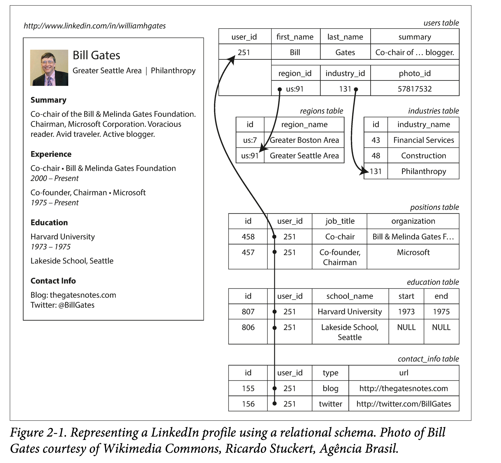
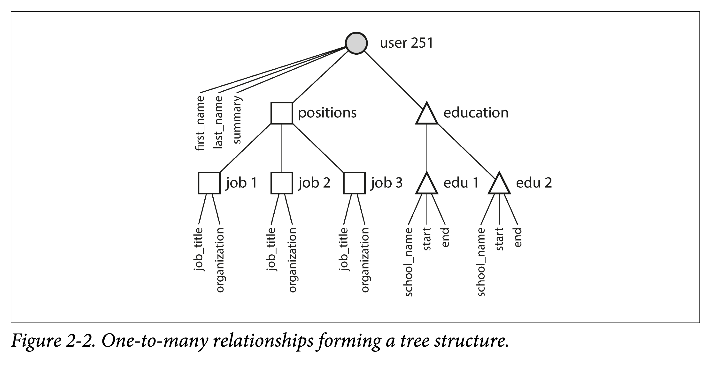

### Data model and query language

How to analyze a data model:

1. Basic inspection points: basic elements of data, and the correspondence between elements (one-to-many, many-to-many)
2. Several commonly used models are used for comparison: (the most popular) relational model, (tree-like) document model, (large degree of freedom) graph model.
3. Schema mode: Strong Schema (write-time constraints); weak Schema (read-time parsing)

How to consider query language:

1. How to associate and match with data model
2. Declarative and imperative

### Data Model

A data model is an abstract model that organizes elements of data and standardizes how they relate to one another and to the properties of real-world entities. —https://en.wikipedia.org/wiki/Data_model

Data model: how to organize data, how to standardize relationships, and how to relate to reality.
It determines both the way we build software (implementation) and the perspective from which we look at problems (cognition).
The author starts with the different abstraction levels of computers to give everyone an overall look at the generalized data model.
Most applications are built incrementally through layers of different data models.


The core question of each layer of the model: How to use the interface of the next layer to model this layer?

1. As an application developer, you abstract specific real-life problems into a set of objects, data structures, and APIs that operate on them.
2. As a database administrator (DBA), in order to persist the above data structures, you need to express them into a common data model (data model), such as XML/JSON in document databases, tables in relational databases, and graphs in graph databases. 
3. As a database system developer, you need to organize the above data model into a stream of bytes in memory, hard disk, or network, and provide multiple methods for operating data collections.
4. As a hardware engineer, you need to represent a stream of bytes as a potential in a diode (memory), as a pole in a magnetic field (disk), or as a light signal in an optical fiber (network).

At each layer, we isolate and decompose the complexity of the real world by exposing simple data models to the outside world.

This in turn shows that a good data model needs to have two characteristics:

1. Simple and intuitive
2. Composable

Section 2 first explores relational models, document models and their comparisons, followed by related query languages, and finally explores graph models.


### Relational model and document model

**Relational Model**

The relational model is undoubtedly the most popular database model today.

The relational model was first proposed by E. F. Codd in 1969 and explained by "Codd's Twelve Laws". However, few commercially implemented databases can fully follow it, so the relational model later generally refers to this type of database. Features are as follows:

1. Present data to users as relationships (for example: a set of two-dimensional tables containing rows and columns).
2. Provides relational operators for operating data collections.

Common categories:

1. Transaction type (TP): bank transactions, train tickets
2. Analytical type (AP): data reports, monitoring dials
3. Hybrid (HTAP):

Many years after the birth of the relational model, although there have been various challengers from time to time (such as the network model and hierarchical model in the 1970s and 1980s), there has still been no fundamental new model that can shake its status. .

Until the past ten years, with the popularization of mobile Internet, data has grown explosively, and various processing requirements have become more and more refined, giving rise to a flourishing of data models.

**Birth of NoSQL**

The core conflict is between the nestedness of object-oriented and the flatness of relational models.



From another perspective, it is difficult for the relational model to intuitively represent a **one-to-many** relationship. For example, on a resume, a person may have multiple educational experiences and multiple work experiences.

**Document model:** Natural nesting using Json and XML.

**Relational model:** To use the SQL model, you have to put the position and education into one table, and then use foreign keys to associate them in the user table.

In the resume example, the document model also has several advantages:

1. Flexible mode: fields can be added and deleted dynamically, such as work experience.
2. Better locality: While all attributes of a person are centrally accessed, they are also centrally stored.
3. Structural expression semantics: The implicit one-to-many tree relationship between resume and contact information, education experience, career information, etc. can be clearly expressed by the tree structure of JSON.

**One to Many, Many to Many**

It is an entry point for comparing various data models.

When storing region, why not directly store the pure string: "Greater Seattle Area", but first store it as region_id → region name, and reference region_id elsewhere?

1. Uniform style: all uses of the same concept have the same spelling and style
2. Avoid ambiguity: there may be regions with the same name
3. Easy to modify: If a region changes its name, we don’t have to modify all references to it one by one.
4. Localization support: If translating to other languages, only the name list can be translated.
5. Better search: the list can be associated with regions and organized in a tree shape

A similar concept is: programming towards abstractions rather than towards details.

Regarding whether to use ID or text, the author mentioned one point: ID is **meaningless** to humans, meaningless means that it will not change with future changes in the real world.

This needs to be considered when designing relational database tables, that is, how to control **redundancy**. There will be several **normalizations** to eliminate redundancy.

Document databases are good at handling one-to-many tree relationships, but not good at handling many-to-many graphical relationships. If it does not support Join, the complexity of processing many-to-many relationships moves from the database side to the application side.

For example, multiple users may have worked in the same organization. If we want to find out people who have worked in the same school and organization, if the database does not support Join, we need to perform a loop traversal on the application side to Join.



Document vs Relationship

1. For one-to-many relationships, document databases place nested data in the parent node instead of taking it out and putting it in another table.
2. For many-to-one and many-to-many relationships, essentially, both are indexed using foreign keys (document references). When querying, join or dynamic follow is required.


### Document model

In the 1970s, IBM's information management system IMS.

A hierarchical database model is a data model in which the data are organized into a tree-like structure. The data are stored as records which are connected to one another through links. A record is a collection of fields, with each field containing only one value. The type of a record defines which fields the record contains. — wikipedia

A few key points:

1. Tree organization, each child node is allowed to have only one parent node
2. Nodes store data, and nodes have types
3. Nodes are connected using pointer-like methods

It can be seen that it is very similar to the document model, so it is difficult to solve many-to-many relationships, and it does not support Join.

To address the limitations of hierarchical models, various solutions have been proposed, the most prominent being:

1. relational model
2. network model

**Network model**

The network model is an extension of the hierarchical model: it allows a node to have multiple parents. It was standardized by the committee of the Conference on Data Systems Languages (CODASYL) and is therefore also known as the CODASYL model.

Both many-to-one and many-to-many can be represented by paths. The only way to access a record is to follow a link consisting of elements and links. This link is called an **access path.** The difficulty is like navigating in n-dimensional space.

Memory is limited, so traversal paths need to be tightly controlled. And the topology of the database needs to be known in advance, which means writing a lot of special code for different applications.

**Relational Model**

In the relational model, data is organized into **tuples**, which are then aggregated into relationships; in SQL they correspond to rows and tables respectively.

I don’t know if you have ever been curious. It looks more like a table model. Why is it called a relational model? The table is just an implementation. The term "relation" comes from set theory and refers to a subset of the Cartesian product of several sets. R ⊆ (D1×D2×D3···×Dn) (The relationship is represented by the symbol R, the attribute is represented by the symbol Ai, and the domain of the attribute is represented by the symbol Di)
Its main purpose and contribution is to provide a **declarative** way to describe data and build queries.

That is, compared with the network model, the query statement and execution path of the relational model are decoupled, and the **query optimizer** (Query Optimizer automatically determines the execution order and the index to be used) decouples the logic and implementation.

For example: If you want to query your data set in a new way, you only need to create an index on the new field. Then when querying, you do not need to change your user code, the query optimizer will dynamically select the available indexes.


### Document vs Relational

Choose a data model based on data type

|                             | Document Type                                                | Relational Type                                              |
| --------------------------- | ------------------------------------------------------------ | ------------------------------------------------------------ |
| Correspondence relationship | Data has a natural one-to-many, tree-shaped nesting relationship, such as resumes. | Many-to-one and many-to-many relationships can be processed through foreign keys + Join |
| Code simplification         | If the data has a document structure, the document model is naturally suitable. Using the relational model will make modeling cumbersome and access complicated.  But it is not advisable to nest too deeply, because you can only manually specify the access path. | primary keys, indexes, and conditional filtering.            |
| Join Support                | The support for Join is not very good.                       | The support is okay, but there are many difficulties in the implementation of Join. |
| Schema flexibility          | weak schema, supports dynamic addition of fields             | strong schema, modification of schema is very costly         |
| Access locality             | Access the entire document at one time, which is better. Only access part of the document, which is poor | Scattered in multiple tables.                                |

For highly correlated data sets, it is strange to use document type expression, it is acceptable to use relational type, and it is most natural to use graph model.


### Schema flexibility in document models

| Data Models     | Document Type                                                | Programming Language |                                            | Performance & Space                                          |
| --------------- | ------------------------------------------------------------ | -------------------- | ------------------------------------------ | ------------------------------------------------------------ |
| Schema on read  | There is no verification when writing, but dynamic parsing when reading. | weak                 | Dynamic, resolved at runtime               | Dynamic parsing when reading, poor performance. The type cannot be determined when writing, cannot be aligned, and space utilization is poor. |
| Schema on write | Verification when writing, data aligned to schema            | strong               | Static, Static, determined at compile time | Performance and space usage are both better.                 |

Features of document database usage scenarios:

There are many types of data, but it is not appropriate to put a table for each.
Data types and structures are determined externally, and you have no control over data changes.


### Data locality at query time

If you need all the content in the document at the same time, storing the documents sequentially will make access more efficient.

But if you only need to access certain fields in the document, the document still needs to be loaded out in its entirety.

But the use of this locality is not limited to document databases. Different databases will adjust the physical distribution of data to adapt to the locality of common access patterns for different scenarios.

* Spanner allows tables to be declared embedded in parent tables - commonly used relational embedding (obtaining a document model-like structure)
* HBase and Cassandra use column families to aggregate data - analytical
* In the graph database, the points and outgoing edges are stored on one machine - graph traversal


### Integration of relational and document types

* MySQL and PostgreSQL began to support JSON natively. It can be understood that MySQL can understand the JSON type. For example, in complex formats such as Date, you can make a field a JSON type, modify a certain attribute of the Join field, and create an index on a certain attribute in the Json field.
* RethinkDB supports relational-link Joins in queries

Codd: nonsimple domains. In addition to simple types (numbers, strings), the values in the record can also be a nested relationship (table). This is much like SQL's support for XML and JSON.


### Data query language

Get all shark-like animals in the animal table.

```sql
function getSharks() {
  var sharks = [];
  for (var i = 0; i < animals.length; i++) {
    if (animals[i].family === 'Sharks') {
      sharks.push(animals[i]);
    }
  }
  return sharks;
}
SELECT * FROM animals WHERE family = 'Sharks';
```

|                       | Declarative Language                                         | **Imperative Language**                                      |
| --------------------- | ------------------------------------------------------------ | ------------------------------------------------------------ |
| Concept               | Describe control logic rather than execution flow            | Describe the execution process of the command and use a series of statements to continuously change the state |
| Abstract              | High                                                         | Low                                                          |
| Decoupling            | Decoupled from implementation. Can continuously optimize query engine performance | Deep coupling with implementation.                           |
| Interpreter Execution | Lexical analysis → Syntax analysis → Semantic analysis<br/>Generate execution plan → Execution plan optimization | Lexical analysis → Syntax analysis → Semantic analysis<br/>Intermediate code generation → code optimization → target code generation |
| Multi-threading       | Declarative has more multi-core potential and gives more room for runtime optimization. | Since the imperative style specifies the order of code execution, there is less room for optimization at compile time. |
| Example               | SQL，CSS，XSL                                                | IMS，CODASYL C，C++，JS                                      |


### Beyond the Database: Declarative on the Web

Requirement: The background of the selected page turns blue.

```Html
<ul>
  <li class="selected">
    <p>Sharks</p>
    <ul>
      <li>Great White Shark</li>
      <li>Tiger Shark</li>
      <li>Hammerhead Shark</li>
    </ul>
  </li>
  <li>
    <p>Whales</p>
    <ul>
      <li>Blue Whale</li>
      <li>Humpback Whale</li>
      <li>Fin Whale</li>
    </ul>
  </li>
</ul>
```

If using CSS, just (CSS selector):

```CSS
li.selected > p {
  background-color: blue;
}
```

If using XSL, just (XPath selector):

```css
<xsl:template match="li[@class='selected']/p">
    <fo:block background-color="blue">
        <xsl:apply-templates/>
    </fo:block>
</xsl:template>
```

But if using JavaScript (without resorting to the selector library mentioned above):

```jsx
var liElements = document.getElementsByTagName('li');
for (var i = 0; i < liElements.length; i++) {
  if (liElements[i].className === 'selected') {
    var children = liElements[i].childNodes;
    for (var j = 0; j < children.length; j++) {
      var child = children[j];
      if (child.nodeType === Node.ELEMENT_NODE && child.tagName === 'P') {
        child.setAttribute('style', 'background-color: blue');
      }
    }
  }
}
```

