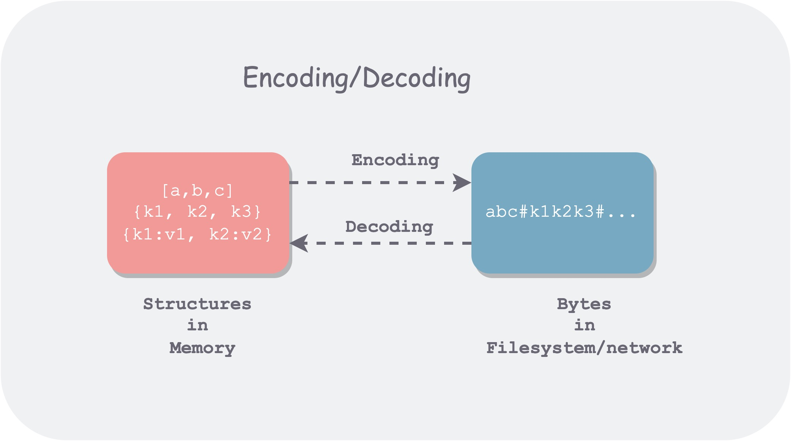
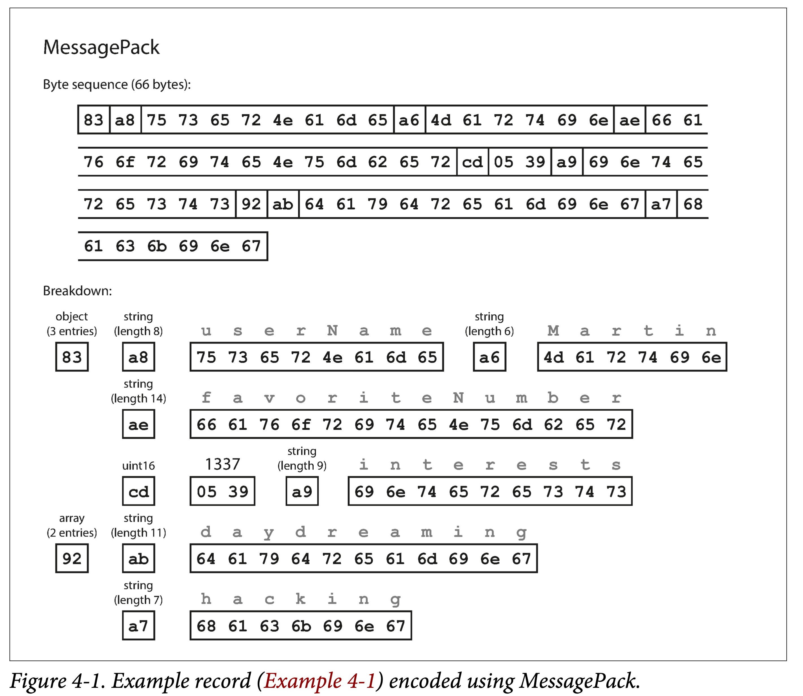
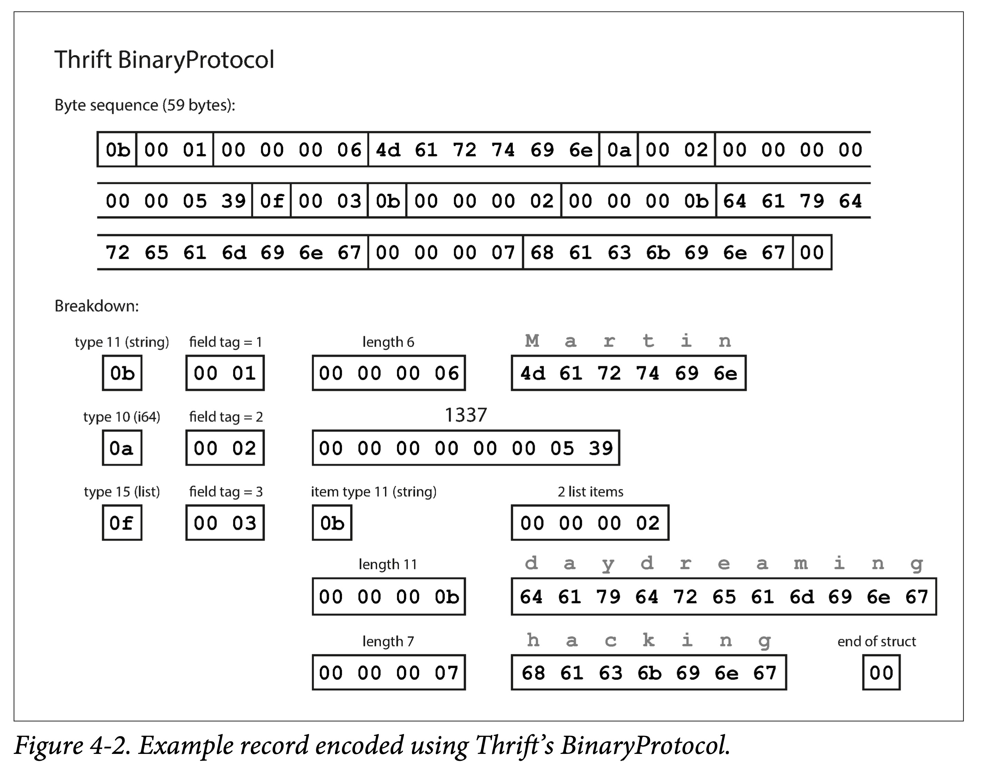
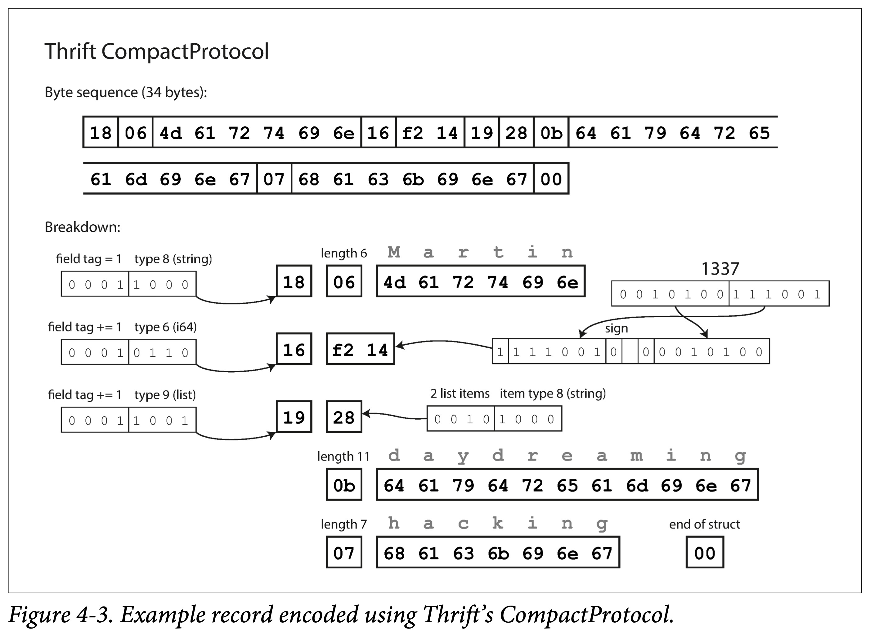
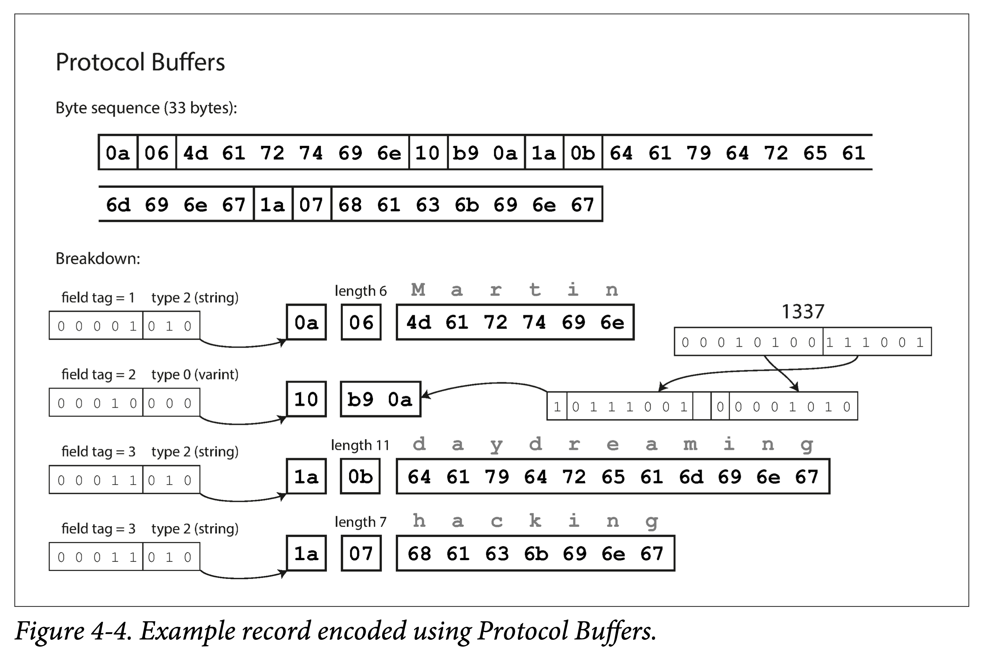
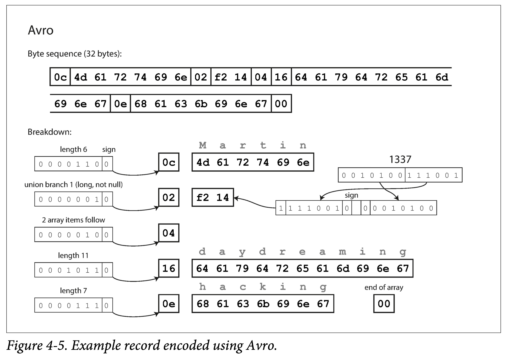
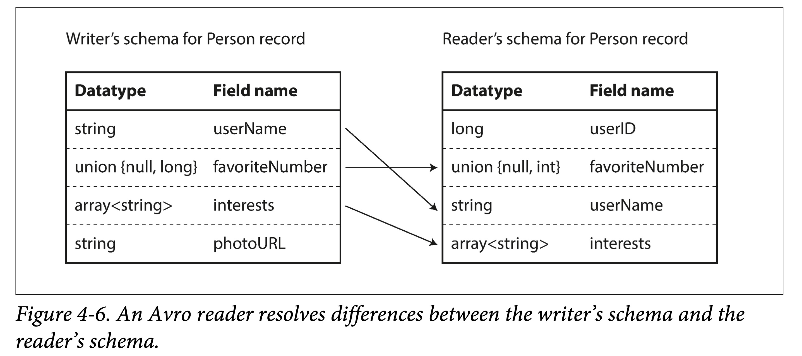
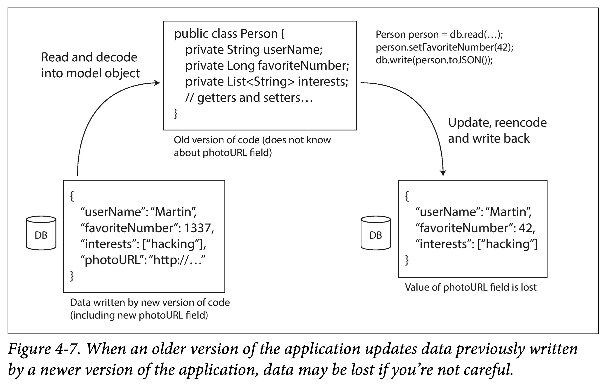

### Encoding and Evolution

Wherever cross-process communication is involved, data needs to be **encoded (Encoding), or serialized (Serialization)**. Because persistent storage and network transmission are both byte stream oriented. Serialization is essentially a "dimensionality reduction" operation, which reduces the dimensionality of high-dimensional data structures in memory into a single-dimensional byte stream. Therefore, the underlying hardware and related protocols only need to process one-dimensional information.

Coding mainly involves two aspects:

1. How to code can save space and improve performance.
2. How to code to adapt to data evolution and compatibility.

The first section takes several common encoding tools (JSON, XML, Protocol Buffers and Avro) as examples to discuss one by one how to encode and how to achieve multi-version compatibility. Two very important concepts arise here:

**Backward compatibility**: Current code can read data written by older versions of the code.
**Forward compatibility**: The current code can read data written by the new version of the code.


Among them, backward compatibility is more common, because time always passes forward and versions are always upgraded, so the code after the upgrade always has to deal with the historical backlog of data, which naturally causes backward compatibility problems. Forward compatibility is relatively rare. The example given in the book is a multi-instance rolling upgrade, but its duration is also very short.

### Data encoding format



Encoding has many names, such as serialization or marshalling. Correspondingly, decoding also has many aliases, including parsing, deserialization, and unmarshalling.

* Why is the data in memory so different from that in external memory and the network? In memory, with the help of a compiler, we can interpret memory into various data structures; but in file systems and networks, we can only read byte streams through a few limited operations such as seek\read. What about mmap?
* Encoding and serialization crash? In transactions, there are also serialization-related terms, so here is dedicated coding to avoid ambiguity.
* Encoding and encryption? The research scope is different. Encoding is for persistence or transmission, focusing on format and evolution; encryption is for security, focusing on security and anti-cracking.


### Programming language built-in

Many programming languages have some built-in default encoding methods:

Java has java.io.Serializable
Ruby has Marshal
Python has pickles
This built-in encoding method is useful if you are certain that your data will only be read by a specific language. For example, since deep learning researchers basically use Python, they often pass data back and forth in pickle format.

However, the encoding formats built into these programming languages have the following disadvantages:

* Bind to a specific language
* Security Question
* Insufficient compatibility support
* low efficiency

### JSON、XML and theirs binary variant

JSON, XML and CSV are commonly used text encoding formats. The advantage is that they are readable by the naked eye, but the disadvantage is that they are not compact enough and take up more space.

JSON was first introduced by JavaScript, so it is used more in Web Services. Of course, with the popularity of the web, it has now become a more common encoding format. For example, many log formats are JSON.

XML is older and more redundant than JSON. It is sometimes used in configuration files, but overall it is used less and less.

CSV (comma\TAB, newline delimited) is relatively compact, but has limited expressive power. Database table export is sometimes used.

In addition to being less compact, text encoding has the following disadvantages:

1. Insufficient support for numeric types. CSV and XML are not supported directly, everything is a string. Although JSON distinguishes between strings and numeric values, it does not further distinguish between subdivided numeric types. It's understandable, after all, text encoding is mainly oriented to strings.

2. Insufficient support for binary data. Unicode is supported, but binary string support is not sufficient and may appear as garbled characters. Although it can be bypassed by Base64 encoding, it feels like a useless effort.

3. XML and JSON support additional schemas. A schema describes the type of data and tells you how to understand the data. With these pattern languages, although XML and JSON can become powerful, it greatly increases the complexity.
   CSV doesn't have any schema.

4. Everything must be sufficient. 

   

In many scenarios, the data needs to be readable and encoding efficiency is not a concern, so these encoding formats are sufficient.


### Binary Encoding

If the data is only read by a single program, there is no need to exchange it, and there is no need to consider issues such as legibility. Then binary encoding can be used. After the amount of data reaches a certain level, the space saving and speed improvement brought by binary encoding are considerable.

Therefore, JSON has many binary variants: MessagePack, BSON, BJSON, UBJSON, BISON, Smile, etc.

For the following example,


```json
{
  "userName": "Martin",
  "favoriteNumber": 1337,
  "interests": ["daydreaming", "hacking"]
}
```

If encoded with MessagePack, it is:



It can be seen that the basic encoding strategy is: use type, length, bit string, sequential encoding, and remove useless colons, quotation marks, and curly braces.

This reduces the 81 bytes of JSON encoding to 66 bytes, which is a slight improvement.


### Thrift and Protocol Buffers

Thrift was originally developed by Facebook, and ProtoBuf was open sourced by Google around 2007~08. They all have corresponding RPC frameworks and encoding and decoding tools. The expression capabilities are similar, and the syntax is similar. Before coding, the interface definition language (IDL) needs to be used to describe the pattern:

```protobuf
struct Person {
    1: required string       userName,
    2: optional i64          favoriteNumber,
    3: optional list<string> interests
}
```

```protobuf
message Person {
    required string user_name       = 1;
    optional int64  favorite_number = 2;
    repeated string interests       = 3;
}
```

IDL is programming language independent, and relevant code generation tools can be used to translate the above IDL into code in a specified language. That is, by integrating these generated codes, the same format encoding and decoding can be used regardless of the language.

This is also the basis for different services to use different coding languages and communicate with each other.

In addition, Thrift also supports a variety of different encoding formats, commonly used ones are: Binary, Compact, JSON. It allows users to make their own choices among: coding speed, space usage, and readability.



Its characteristics can be seen:

Use field tag encoding. Field tag actually contains field type and name.
Use type, tag, length, bit array sequential encoding.



Compared with Binary Protocol, Compact Protocol is optimized by:

1. filed tag only records delta.
2. This compresses the field tag and type into one byte.
3. Use variable length encoding and Zigzag encoding for numbers.

ProtoBuf is very similar to the Thrift Compact Protocol encoding method, and also uses variable length encoding and Zigzag encoding. However, ProtoBuf's processing of arrays is significantly different from Thrift. It uses repeated prefixes instead of real arrays. 



### Field labels and schema evolution

Mode, that is, what fields are there and what types are the fields.

As time goes by, business will always change, and we will inevitably add, delete fields, and modify field types, that is, schema evolution.

After the mode is changed, needing to:

1. Backwards compatibility: The new code must process the old existing data while processing the new incremental data format.

2. Forward compatibility: Old code cannot crash if it encounters a new data format.

   How do ProtoBuf and Thrift solve these two problems? Field label + qualifier (optional, required) Backward compatibility: newly added fields must be optional. In this way, when parsing old data, there will be no missing fields. Forward compatibility: Field labels cannot be modified, only appended. In this way, when the old code sees an unknown label, it can be omitted.

### Data type and schema evolution

Modifying data types is troublesome: modifications can only be made in compatible types.

For example, the string cannot be modified into an integer, but it can be modified within the integer: 32 bit to 64 bit integer.

ProtoBuf does not have a list type, but a repeated type. The advantage is that while being compatible with array types, it supports changing optional single-value fields into multi-value fields. After modification, the old code will only use the last element when it sees the new multi-valued field.

Although the Thrift list type does not have this flexibility, it can be nested.


### Avro

Apache Avro is a sub-project of Apache Hadoop. It is specially designed for data-intensive scenarios and has good support for schema evolution. Supports Avro IDL and JSON two schema languages, the former is suitable for human editing, and the latter is suitable for machine reading.

```protobuf
record Person {
    string                userName;
    union { null, long }  favoriteNumber = null;
    array<string>         interests;
}
```

```json
{
  "type": "record",
  "name": "Person",
  "fields": [
    { "name": "userName", "type": "string" },
    { "name": "favoriteNumber", "type": ["null", "long"], "default": null },
    { "name": "interests", "type": { "type": "array", "items": "string" } }
  ]
}
```

You can see that Avro does not use field labels.

Still the example before encoding, Avro only uses 32 bytes, why? He is not typed.




### Write mode and read mode

Without field labels, how does Avro support schema evolution? The answer is to explicitly use both modes.
That is, when encoding data (writing to a file or transmitting), use mode A, called **writer schema**; when decoding data (reading from a file or network), use mode B, It's called a reader schema, and the two don't have to be the same, they just need to be compatible.

In other words, Avro can handle both backward and forward compatibility as long as the schema is compatible when evolving.

**Backward compatibility**: new code reads old data. That is, when reading, first obtain the writing mode of the old data (i.e., the old mode), and then compare it with the reading mode (i.e., the new mode) to obtain the conversion mapping, which can be used to parse the old data.

**Forward compatibility**: old code reads new data. The principle is similar, except that a reverse mapping needs to be obtained.

There are some rules when mapping from write mode to read mode:

1. Use field names to match. Therefore, it does not matter if the order of field names in the write mode and the read mode is different.
2. Ignore extra fields.
3. Fill in default values for missing fields.




### Pattern evolution rules

So how to ensure the compatibility of writing modes?

1. When adding or deleting fields, only fields with default values can be added or deleted.
2. When changing the field type, Avro needs to support the corresponding type conversion.

Avro does not have optional and required qualifiers like ProtoBuf and Thrift. It uses union to specify default values or even multiple types:

```
union {null, long, string} field;
```

Note: The default value must be the type of the first branch of the union.

Changing field names and adding types to unions are backward compatible, but not forward compatible. Think about why?


### How to get writing mode from encoding

For a given piece of Avro-encoded data, how does Reader obtain its corresponding writing mode from it?

This depends on different application scenarios.

1. Large files in which all data entries are homogeneous are typically found in the Hadoop ecosystem. If all records in a large file use the same mode encoding, just include the write-once mode in the file header.
2. Database tables that support schema changes Because database tables allow schema modifications, rows in them may be written in different schema stages. In this case, you can record an additional schema version number (for example, auto-increment) when encoding, and then store all schema versions somewhere. When decoding, just query the corresponding writing mode through the version.
3. Sending data over the network During the handshake phase of communication between two processes, write patterns are exchanged. For example, exchanging modes at the beginning of a session, and then using this mode throughout the session life cycle.


### Dynamically generate patterns in data

One benefit of Avro not using field labels is that there is no need to manually maintain the mapping of field labels to field names, which is very friendly to dynamically generated data schemas.

The example given in the book is to export and back up the database. Note that it is not the same as using Avro encoding for the database itself. Here, the guidance is to use Avro encoding for the exported data.

Before and after the database table schema changes, Avro only needs to perform corresponding conversions based on the current schema during export and generate corresponding schema data. But if you use PB, you need to handle the mapping relationship between field labels and field names in multiple backup files yourself. The essence is that Avro's data schema can exist together with the data, but ProtoBuf's data schema can only be reflected in the generated code, and it is necessary to manually maintain the mapping between the old and new versions of backup data and the code generated by PB.


### Code generation and dynamic languages

Thrift and Protobuf generate codecs for a given language based on patterns defined by language-independent IDL. This is useful for static languages, as it allows type checking to be leveraged by the IDE and compiler, and can improve encoding and decoding efficiency.

The above idea essentially lies in internalizing the pattern into the generated code.

But for dynamic languages, or interpreted languages, such as JavaScript, Ruby or Python, since there is no compile-time check, the meaning of generated code is not that great, but there will be a certain degree of redundancy. At this time, Avro, a framework that supports no code generation, can save some money. It can write the pattern into the data file, and use Avro to dynamically parse it when reading.


###  Advantages of patterns

The essence of the schema is explicit type constraints, that is, there must be a schema before there is data.

Compared to text encodings such as JSON, XML and CSV, which do not have any type constraints, Protocol Buffers, Thrift and Avro have the following advantages:

1. Omitting field names makes it more compact.
2. A schema is an annotation or documentation of the data and is always up to date.
3. The data mode allows not reading the data, but only comparing the mode to do a low-cost compatibility check.
4. For static types, code generation can be used to do compile-time type checking.

Schema evolution vs read-time schema


### Some data flow models

Data can flow from one system to another in many forms, but what remains the same is that it requires encoding and decoding.

When data flows, the issue of pattern matching on both encoding and decoding sides will be involved. This has been discussed in the previous section. This section mainly discusses several typical data flow methods between processes:

1. via database
2. call via service
3. via asynchronous messaging


### Data flow through database

Programs that access the database may:

1. Only accessed by the same process. Then the database can be understood as an intermediary for the process to send data to the future.
2. Accessed by multiple processes. Then some of the multiple processes may be old versions and some may be new versions. At this time, the database needs to consider forward and backward compatibility issues.

There's also a trickier situation: at some point, you add a field to a table, and newer code writes rows with that field, which are later overwritten by older code with rows that lack the field. A problem will arise at this time: we updated a field A, but after the update, we found that field B was gone.




### Data written at different times

For applications, it may be possible to replace an old version with a new version within a short period of time. But for data, the amount of data written by the old version of the code may be large over the years. After changing the schema, due to the large amount of data in these old schemas, it is very expensive to update all the data to align with the new version.

We call this situation: the life cycle of the data exceeds the life cycle of its corresponding code.

When reading, the database generally treats old data that lacks corresponding columns:

1. Populate the default value of the new version field
2. If there is no default value, fill in null value (nullable)
   and then returned to the user. 

Generally speaking, when changing the schema (such as alter table), the database does not allow adding columns that have neither default values nor empty columns.


### Storage archive

Sometimes it is necessary to back up the database to external storage. When making backups (or snapshots), although there will be data generated at different points in time, various versions of data are usually converted and aligned to the latest version. After all, you always have to copy the data in its entirety, so just do the conversion along the way.

As mentioned before, for this scenario, where one-time immutable backup or snapshot data is generated, Avro is more suitable. This is also a good opportunity to output the data in the required format, such as the column-based storage format for analysis: Parquet.


### Data flow through services: REST and RPC

When communicating over a network, there are usually two roles involved: server and client.

Generally speaking, HTTP services are mostly exposed to the public network, while RPC services are often used internally.

The server can also be a client at the same time:

1. Access the database as a client.
2. Access other services as a client.
   For the latter, it is because we often split a large service into a set of functionally independent and relatively decoupled services. This is service-oriented architecture (SOA), or the recently popular microservice architecture (microservice architecture). -services architecture). There are some differences between the two, but I won’t go into them here.

Services are similar to databases in a way: they allow clients to store and query data in some way. But the difference is that databases usually provide some kind of flexible query language, while services can only provide relatively rigid APIs.

### web service

When a service uses HTTP as the communication protocol, we usually refer to it as a web service. But it is not limited to the web, it also includes:

1. User terminals (such as mobile terminals) make requests to the server through HTTP.
2. One service within the same organization sends an HTTP request to another service (microservices architecture, some components of which are sometimes called middleware).

3. Data exchange between services of different organizations. Verification generally requires some means, such as OAuth.

There are two ways to design an HTTP API: REST and SOAP.

1. **REST is not a protocol, but a design philosophy.** It emphasizes a simple API format, uses URL to identify resources, and uses HTTP actions (GET, POST, PUT, DELETE) to add, delete, modify and check resources. It is becoming more and more popular due to its simple style.
2. SOAP is an XML-based protocol. Although HTTP is used, the intent is to be independent of HTTP. There are fewer mentions now.

### Problems faced by RPC

RPC wants to make calling remote services as natural as calling local (in the same process) functions. Although the idea is better and it is used more now, there are still some problems:

1. Local function calls either succeed or fail. However, because RPC passes through the network, there may be various complications, such as request loss, response loss, hang, and timeout, etc. Therefore, it may be necessary to try again.
2. If you try again, you need to consider idempotence issues. Because the last request may have reached the server, but the request did not return successfully. So multiple calls to the remote function must ensure that no additional side effects are caused.
3. The remote call delay is not available and is greatly affected by the network.
4. The programming languages used by the client and the server may be different, but if some types are not available in both languages, there will be some problems.

The advantage of REST compared to RPC is that it does not try to **hide the network and is more explicit**, making it not difficult for users to ignore the impact of the network.


### RPC current direction

Despite the above problems, in most cases in engineering, the above situations are within the tolerance range:

1. For example, LAN networks are usually fast and controllable.
2. Use idempotence to resolve multiple calls.
3. Cross-language, can be solved using the IDL of the RPC framework.

However, the RPC program needs to consider the extreme situations mentioned above, otherwise an unpredictable BUG may accidentally occur.

Additionally, binary-encoded RPC is generally more efficient than HTTP-based services. But the advantage of HTTP services, or more specifically, RESTful APIs, is that they have a good ecosystem and are supported by a large number of tools. The API of RPC is usually highly related to the code generated by the RPC framework, so it is difficult to painlessly exchange and upgrade in different organizations.

Therefore, as mentioned at the beginning of this section: HTTP services are mostly exposed to the public network, while RPC services are often used internally.


### The evolution of data encoding and RPC

The flow of data through a service can usually be assumed to be: all servers are updated first, and then the clients are updated. Therefore, you only need to consider backward compatibility in requests and forward compatibility in responses:

1. Thrift, gRPC (Protobuf), and Avro RPC can evolve based on encoding format compatibility rules.
2. RESTful APIs usually use JSON as the format of request and response. JSON is easier to add new fields for evolution and compatibility.
3. SOAP press does not mean.

For RPC, service compatibility is more difficult, because once the SDK of the RPC service is provided, you cannot control its life cycle: there are always users who will not actively upgrade for various reasons. Therefore, it may be necessary to maintain compatibility for a long time, or to provide advance notice and continuous notice, or to maintain multiple versions of the SDK and gradually phase out early versions.

For RESTful APIs, a common compatibility method is to put the version number in the URL or HTTP request header.


### Data flow via messaging

Different ways of encoding and decoding were studied earlier:

1. Database: one process writes (encodes), a future process reads (decodes)
2. RPC and REST: One process sends a request to another process over the network (encoded before sending) (decoded after received) and waits for a response synchronously.

This section studies an asynchronous messaging system between database and RPC: one storage (message broker, message queue to temporarily store messages) + two RPCs (one for the producer, one for the consumer).

Advantages of using message queues compared to RPC:

1. Can act as a staging system if the consumer is temporarily unavailable.
2. When the consumer crashes and restarts, the message is automatically resent.
3. The producer does not have to know the consumer IP and port.
4. A message can be sent to multiple consumers.
5. Decouple producers and consumers.


### Message queue

The book uses Message Broker, but another name, message queue, may be more familiar to everyone. Therefore, the text after this section will use message queue.

In the past, message queues were monopolized by large manufacturers. But in recent years, there have been more and more open source message queues that can adapt to different scenarios, such as RabbitMQ, ActiveMQ, HornetQ, NATS and Apache Kafka, etc.

Message Queuing delivery guarantees vary by implementation and configuration, including:

1. At-least-once: The same piece of data may be delivered to consumers multiple times.
2. At-most-once: The same piece of data will be delivered to the consumer at most once and may be lost.
3. Strictly-once: The same piece of data is guaranteed to be delivered once, and to the consumer at most once.

The logical abstraction of message queue is called Queue or Topic, and there are two commonly used consumption methods:

1. Multiple consumers consume a Topic mutually exclusive

2. Each consumer has an exclusive Topic

**Note:** We sometimes distinguish between these two concepts: point-to-point mutually exclusive consumption is called Queue, and multi-point-to-multipoint publish and subscribe is called Topic, but this is not universal, or there is no consensus.

A Topic provides a unidirectional data flow, but multiple Topics can be combined to form a complex data flow topology.

Message queues are usually **byte array oriented**, so you can encode messages in any format. If the encoding is backward and forward compatible, the message format of the same topic can evolve flexibly.


### Distributed Actor Framework

The Actor model is a concurrent programming model based on message passing. Actor usually consists of three parts: State, Behavior and MailBox (which can be thought of as a message queue):

1. Status: The status information contained in the Actor.
2. Behavior: The calculation logic of the state in the Actor.
3. Mailbox: The cache of messages received by the Actor.

Since actors interact with the outside world through messages, they can be parallelized and do not require locking.

The distributed actor framework essentially integrates the message queue and actor programming model. Naturally, during the rolling upgrade of Actors, forward and backward compatibility issues also need to be considered.